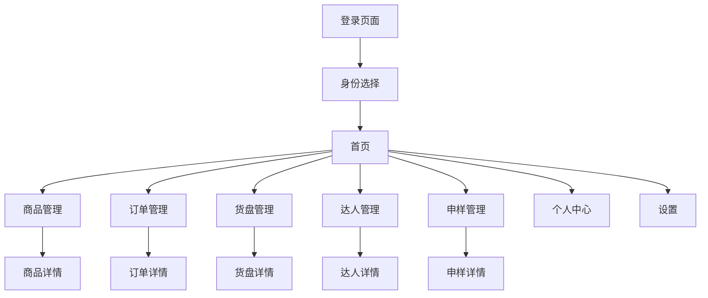

# 云推客严选产品需求文档

## 1. 产品概述
云推客严选是一个深度扎根视频号电商生态的综合性电商服务平台，集全品类商品数据追踪、运营策略辅助、高佣商品聚合及三方角色协同为一体。为商家/团长/达人提供一站式解决方案，通过精准数据洞察、爆款复制引擎、高效变现通路和生态协作网络，构建价值共创生态。

## 2. 核心功能

### 2.1 用户角色
| 角色 | 注册方式 | 核心权限 |
|------|----------|----------|
| 商家 | 微信授权登录+实名认证 | 商品管理、招商管理、申样管理、数据分析 |
| 团长 | 微信授权登录+团长ID绑定 | 货盘管理、达人管理、订单管理、商品招商 |
| 达人 | 微信授权登录+手机号验证 | 选品中心、订单查看、申样功能、积分系统 |

### 2.2 功能模块
我们的云推客严选平台包含以下主要页面：
1. **登录页面**：微信授权登录、身份选择、手机号验证
2. **首页**：搜索功能、身份切换、平台切换、金刚区、爆品推荐、精选货盘、商品榜单
3. **商品管理页面**：商品库、商品详情、数据监控、竞品分析
4. **订单管理页面**：数据看板、订单明细、多维排行
5. **货盘管理页面**：货盘创建、商品组合、数据追踪
6. **达人管理页面**：达人资源库、邀请链接、绑定关系
7. **申样管理页面**：申样请求、状态追踪、审核处理
8. **个人中心页面**：基础信息、积分商城、橱窗管理
9. **设置页面**：账号管理、协议展示、关于我们

### 2.3 页面详情
| 页面名称 | 模块名称 | 功能描述 |
|----------|----------|----------|
| 登录页面 | 微信授权 | 集成微信SDK实现一键登录，获取用户基础信息 |
| 登录页面 | 身份选择 | 弹窗选择商家/团长/达人身份，设置用户角色权限 |
| 首页 | 搜索模块 | 支持商品名称、关键词、ID、链接多维度搜索，提供相似商品推荐 |
| 首页 | 身份切换 | 团长切换不同团队，达人切换不同团长货盘 |
| 首页 | 平台切换 | 视频号/抖音/快手三平台数据切换入口 |
| 首页 | 金刚区 | 主推商品、我的收藏、达人管理、积分兑换、意见反馈快捷入口 |
| 首页 | 爆品推荐 | 团长添加爆品展示，包含推荐理由和寄样标准 |
| 首页 | 精选货盘 | 团长动态调整的专属商品组合展示 |
| 首页 | 商品榜单 | 热销榜/增速榜/高佣榜/新品榜，支持多维筛选 |
| 商品管理页面 | 商品库 | 多维搜索、类目分类、SKU管理、数据指标展示 |
| 商品管理页面 | 数据监控 | 实时商品数据看板，销量、转化率、流量分析 |
| 商品管理页面 | 竞品分析 | 竞品对比报告，价格、销量、推广策略分析 |
| 订单管理页面 | 数据看板 | 销售额、佣金、退款率等核心指标统计 |
| 订单管理页面 | 订单明细 | 按状态分类管理，实时同步订单数据 |
| 订单管理页面 | 多维排行 | 商品、店铺、达人业绩排行榜 |
| 货盘管理页面 | 货盘创建 | 动态创建和调整货盘商品组合 |
| 货盘管理页面 | 数据追踪 | 货盘销量、转化率、达人数量统计 |
| 达人管理页面 | 达人资源库 | 达人粉丝画像、带货数据、合作历史 |
| 达人管理页面 | 邀请链接 | 生成专属邀请链接，绑定达人关系 |
| 申样管理页面 | 申样请求 | 向商家或团长发起申样请求 |
| 申样管理页面 | 状态追踪 | 申样进度跟踪，待审核到已完成状态管理 |
| 个人中心页面 | 基础信息 | 用户资料管理、实名认证、权限设置 |
| 个人中心页面 | 积分商城 | 积分兑换现金或实物奖励 |
| 个人中心页面 | 橱窗管理 | 达人商品橱窗管理，一键添加商品 |

## 3. 核心流程

### 商家流程
商家通过微信授权登录后进行实名认证，在商品管理模块上传和管理商品信息，通过数据看板监控商品表现，在招商管理模块对接团长和达人，处理申样请求并查看合作数据报表。

### 团长流程
团长登录后绑定视频号团长ID，在商品库中搜索和筛选商品，创建专属货盘并邀请达人加入，通过达人管理模块维护达人关系，监控订单数据和货盘表现，向商家发起合作邀请。

### 达人流程
达人通过团长邀请链接注册并绑定关系，在选品中心浏览高佣商品和爆款榜单，一键添加商品到橱窗，查看订单明细和佣金收益，向团长申请样品进行带货。

## 4. 用户界面设计

### 4.1 设计风格
- 主色调：#1890FF（科技蓝）、#52C41A（成功绿）
- 辅助色：#FAAD14（警告黄）、#F5222D（错误红）
- 按钮样式：圆角8px，渐变背景，阴影效果
- 字体：PingFang SC，主标题16px，正文14px，辅助文字12px
- 布局风格：卡片式设计，顶部导航，底部Tab栏
- 图标风格：线性图标，简洁现代，支持主题色彩

### 4.2 页面设计概览
| 页面名称 | 模块名称 | UI元素 |
|----------|----------|--------|
| 登录页面 | 微信授权 | 蓝色渐变背景，白色卡片容器，微信绿色登录按钮，品牌Logo居中 |
| 首页 | 搜索模块 | 白色搜索框，圆角设计，搜索图标，语音输入按钮 |
| 首页 | 金刚区 | 4x2网格布局，彩色图标，白色背景卡片，阴影效果 |
| 首页 | 商品榜单 | Tab切换设计，商品卡片列表，价格标签，佣金徽章 |
| 商品管理页面 | 数据看板 | 仪表盘样式，数据卡片，图表展示，颜色编码 |
| 订单管理页面 | 订单明细 | 列表式布局，状态标签，时间轴设计，筛选器 |
| 货盘管理页面 | 货盘创建 | 拖拽式商品添加，预览模式，保存按钮，分享功能 |

### 4.3 响应式设计
产品采用移动端优先设计，主要适配iOS和Android设备，支持横竖屏切换。针对触屏操作优化，按钮最小点击区域44px，支持手势操作如滑动删除、下拉刷新等。