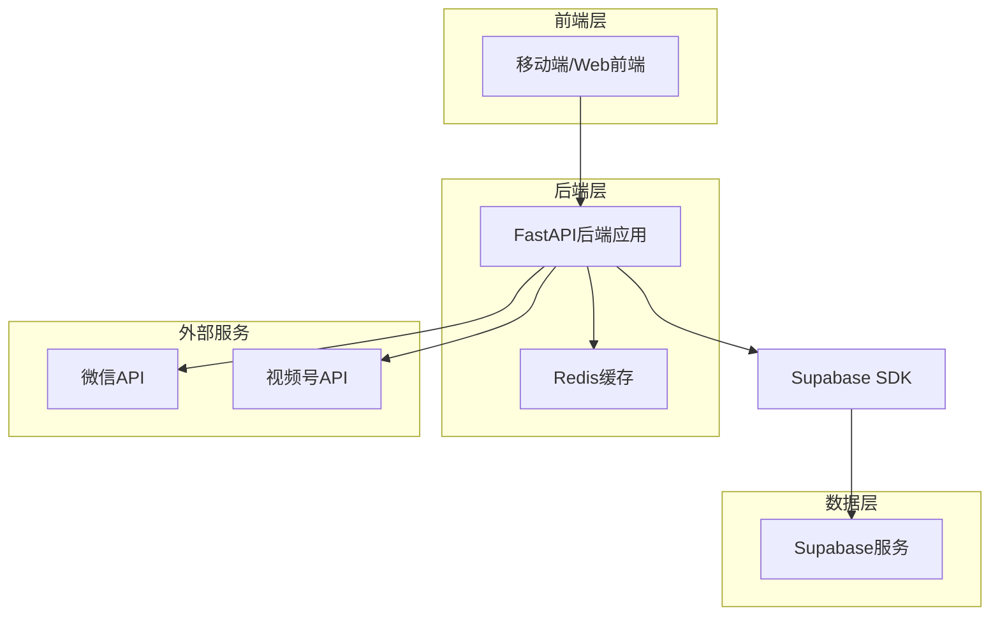
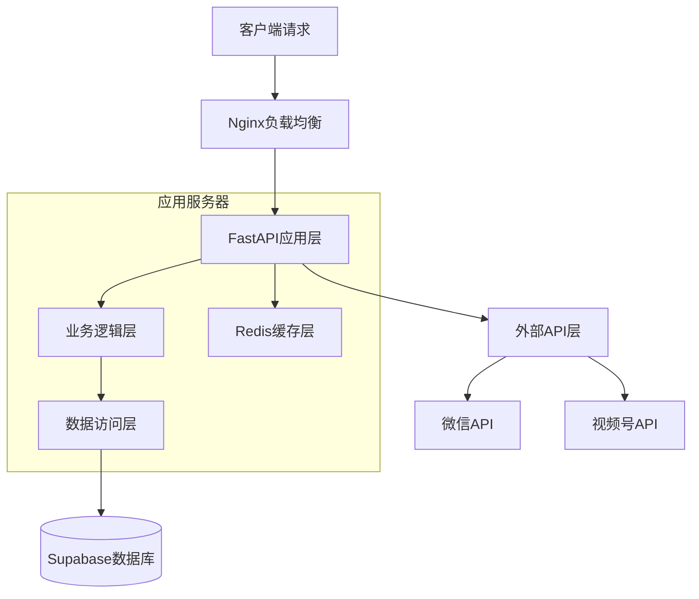
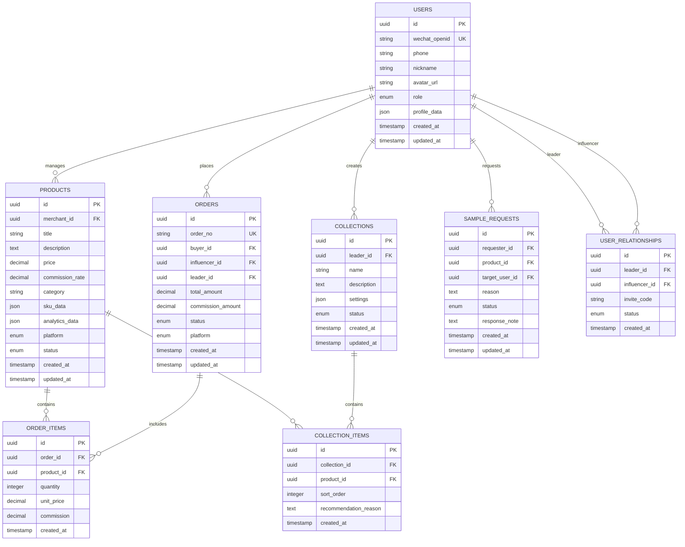

# 云推客严选技术架构文档

## 1. 架构设计



## 2. 技术描述
- 前端：React@18 + TypeScript + Ant Design Mobile + Vite
- 后端：FastAPI@0.104 + Python@3.11 + Pydantic + SQLAlchemy
- 数据库：Supabase (PostgreSQL)
- 缓存：Redis@7.0
- 认证：JWT + 微信OAuth2.0
- 文档：FastAPI自动生成Swagger文档
- 部署：Docker + Nginx

## 3. 路由定义
| 路由 | 用途 |
|------|------|
| /auth | 用户认证相关接口，包括微信登录、token刷新 |
| /users | 用户管理接口，用户信息、角色切换 |
| /products | 商品管理接口，商品CRUD、搜索、分类 |
| /orders | 订单管理接口，订单查询、统计、状态更新 |
| /collections | 货盘管理接口，货盘创建、商品管理、数据统计 |
| /influencers | 达人管理接口，达人信息、绑定关系、数据分析 |
| /samples | 申样管理接口，申样请求、状态跟踪、审核处理 |
| /analytics | 数据分析接口，销售统计、排行榜、趋势分析 |
| /recommendations | 推荐系统接口，个性化推荐、爆品推荐 |

## 4. API定义

### 4.1 核心API

#### 用户认证相关
```
POST /api/auth/wechat-login
```

请求参数：
| 参数名 | 参数类型 | 是否必填 | 描述 |
|--------|----------|----------|------|
| code | string | true | 微信授权码 |
| role | string | true | 用户角色：merchant/leader/influencer |

响应参数：
| 参数名 | 参数类型 | 描述 |
|--------|----------|------|
| access_token | string | JWT访问令牌 |
| refresh_token | string | 刷新令牌 |
| user_info | object | 用户基础信息 |
| expires_in | integer | 令牌过期时间（秒） |

示例：
```json
{
  "code": "wx_auth_code_123",
  "role": "influencer"
}
```

#### 商品管理相关
```
GET /api/products
```

请求参数：
| 参数名 | 参数类型 | 是否必填 | 描述 |
|--------|----------|----------|------|
| page | integer | false | 页码，默认1 |
| size | integer | false | 每页数量，默认20 |
| category | string | false | 商品分类 |
| keyword | string | false | 搜索关键词 |
| sort_by | string | false | 排序字段：sales/commission/price |
| platform | string | false | 平台：wechat/douyin/kuaishou |

响应参数：
| 参数名 | 参数类型 | 描述 |
|--------|----------|------|
| total | integer | 总数量 |
| items | array | 商品列表 |
| page | integer | 当前页码 |
| size | integer | 每页数量 |

#### 订单管理相关
```
GET /api/orders/dashboard
```

请求参数：
| 参数名 | 参数类型 | 是否必填 | 描述 |
|--------|----------|----------|------|
| start_date | string | false | 开始日期 YYYY-MM-DD |
| end_date | string | false | 结束日期 YYYY-MM-DD |
| user_role | string | true | 用户角色 |

响应参数：
| 参数名 | 参数类型 | 描述 |
|--------|----------|------|
| total_sales | decimal | 总销售额 |
| total_commission | decimal | 总佣金 |
| order_count | integer | 订单数量 |
| refund_rate | decimal | 退款率 |

## 5. 服务器架构图



## 6. 数据模型

### 6.1 数据模型定义



### 6.2 数据定义语言

#### 用户表 (users)
```sql
-- 创建用户表
CREATE TABLE users (
    id UUID PRIMARY KEY DEFAULT gen_random_uuid(),
    wechat_openid VARCHAR(100) UNIQUE NOT NULL,
    phone VARCHAR(20),
    nickname VARCHAR(100) NOT NULL,
    avatar_url TEXT,
    role VARCHAR(20) NOT NULL CHECK (role IN ('merchant', 'leader', 'influencer')),
    profile_data JSONB DEFAULT '{}',
    created_at TIMESTAMP WITH TIME ZONE DEFAULT NOW(),
    updated_at TIMESTAMP WITH TIME ZONE DEFAULT NOW()
);

-- 创建索引
CREATE INDEX idx_users_wechat_openid ON users(wechat_openid);
CREATE INDEX idx_users_role ON users(role);
CREATE INDEX idx_users_created_at ON users(created_at DESC);
```

#### 商品表 (products)
```sql
-- 创建商品表
CREATE TABLE products (
    id UUID PRIMARY KEY DEFAULT gen_random_uuid(),
    merchant_id UUID REFERENCES users(id) ON DELETE CASCADE,
    title VARCHAR(200) NOT NULL,
    description TEXT,
    price DECIMAL(10,2) NOT NULL,
    commission_rate DECIMAL(5,2) NOT NULL DEFAULT 0.00,
    category VARCHAR(50),
    sku_data JSONB DEFAULT '{}',
    analytics_data JSONB DEFAULT '{}',
    platform VARCHAR(20) DEFAULT 'wechat' CHECK (platform IN ('wechat', 'douyin', 'kuaishou')),
    status VARCHAR(20) DEFAULT 'active' CHECK (status IN ('active', 'inactive', 'deleted')),
    created_at TIMESTAMP WITH TIME ZONE DEFAULT NOW(),
    updated_at TIMESTAMP WITH TIME ZONE DEFAULT NOW()
);

-- 创建索引
CREATE INDEX idx_products_merchant_id ON products(merchant_id);
CREATE INDEX idx_products_category ON products(category);
CREATE INDEX idx_products_platform ON products(platform);
CREATE INDEX idx_products_status ON products(status);
CREATE INDEX idx_products_commission_rate ON products(commission_rate DESC);
```

#### 订单表 (orders)
```sql
-- 创建订单表
CREATE TABLE orders (
    id UUID PRIMARY KEY DEFAULT gen_random_uuid(),
    order_no VARCHAR(50) UNIQUE NOT NULL,
    buyer_id UUID REFERENCES users(id),
    influencer_id UUID REFERENCES users(id),
    leader_id UUID REFERENCES users(id),
    total_amount DECIMAL(10,2) NOT NULL,
    commission_amount DECIMAL(10,2) DEFAULT 0.00,
    status VARCHAR(20) DEFAULT 'pending' CHECK (status IN ('pending', 'paid', 'shipped', 'completed', 'cancelled', 'refunded')),
    platform VARCHAR(20) DEFAULT 'wechat',
    created_at TIMESTAMP WITH TIME ZONE DEFAULT NOW(),
    updated_at TIMESTAMP WITH TIME ZONE DEFAULT NOW()
);

-- 创建索引
CREATE INDEX idx_orders_order_no ON orders(order_no);
CREATE INDEX idx_orders_influencer_id ON orders(influencer_id);
CREATE INDEX idx_orders_leader_id ON orders(leader_id);
CREATE INDEX idx_orders_status ON orders(status);
CREATE INDEX idx_orders_created_at ON orders(created_at DESC);
```

#### 货盘表 (collections)
```sql
-- 创建货盘表
CREATE TABLE collections (
    id UUID PRIMARY KEY DEFAULT gen_random_uuid(),
    leader_id UUID REFERENCES users(id) ON DELETE CASCADE,
    name VARCHAR(100) NOT NULL,
    description TEXT,
    settings JSONB DEFAULT '{}',
    status VARCHAR(20) DEFAULT 'active' CHECK (status IN ('active', 'inactive', 'deleted')),
    created_at TIMESTAMP WITH TIME ZONE DEFAULT NOW(),
    updated_at TIMESTAMP WITH TIME ZONE DEFAULT NOW()
);

-- 创建索引
CREATE INDEX idx_collections_leader_id ON collections(leader_id);
CREATE INDEX idx_collections_status ON collections(status);
```

#### 申样请求表 (sample_requests)
```sql
-- 创建申样请求表
CREATE TABLE sample_requests (
    id UUID PRIMARY KEY DEFAULT gen_random_uuid(),
    requester_id UUID REFERENCES users(id) ON DELETE CASCADE,
    product_id UUID REFERENCES products(id) ON DELETE CASCADE,
    target_user_id UUID REFERENCES users(id) ON DELETE CASCADE,
    reason TEXT,
    status VARCHAR(20) DEFAULT 'pending' CHECK (status IN ('pending', 'approved', 'rejected', 'completed')),
    response_note TEXT,
    created_at TIMESTAMP WITH TIME ZONE DEFAULT NOW(),
    updated_at TIMESTAMP WITH TIME ZONE DEFAULT NOW()
);

-- 创建索引
CREATE INDEX idx_sample_requests_requester_id ON sample_requests(requester_id);
CREATE INDEX idx_sample_requests_target_user_id ON sample_requests(target_user_id);
CREATE INDEX idx_sample_requests_status ON sample_requests(status);
```

#### 权限设置
```sql
-- 设置基础权限
GRANT SELECT ON ALL TABLES IN SCHEMA public TO anon;
GRANT ALL PRIVILEGES ON ALL TABLES IN SCHEMA public TO authenticated;
GRANT USAGE ON ALL SEQUENCES IN SCHEMA public TO authenticated;

-- 行级安全策略示例
ALTER TABLE users ENABLE ROW LEVEL SECURITY;
CREATE POLICY "Users can view own data" ON users FOR SELECT USING (auth.uid()::text = id::text);
CREATE POLICY "Users can update own data" ON users FOR UPDATE USING (auth.uid()::text = id::text);
```

#### 初始化数据
```sql
-- 插入测试用户数据
INSERT INTO users (wechat_openid, nickname, role, profile_data) VALUES
('test_merchant_001', '测试商家', 'merchant', '{"company": "测试公司", "verified": true}'),
('test_leader_001', '测试团长', 'leader', '{"team_name": "精选团队", "wechat_id": "leader001"}'),
('test_influencer_001', '测试达人', 'influencer', '{"fans_count": 10000, "category": "美妆"}')
ON CONFLICT (wechat_openid) DO NOTHING;
```